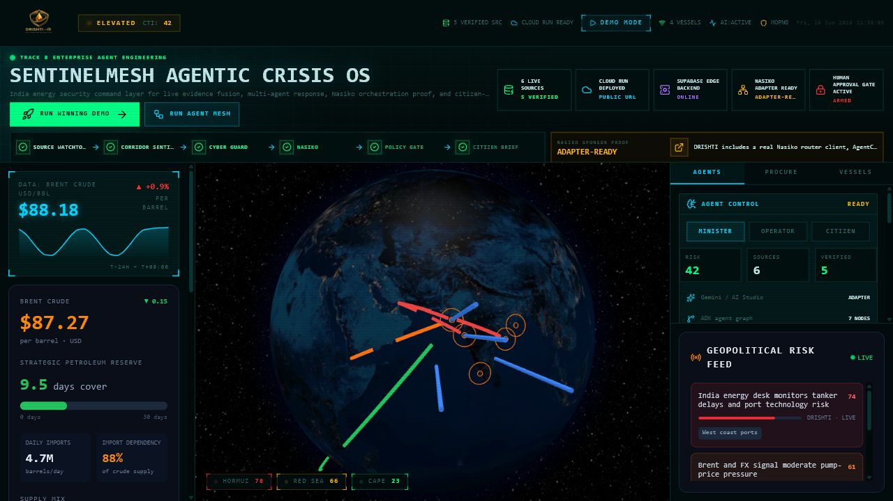
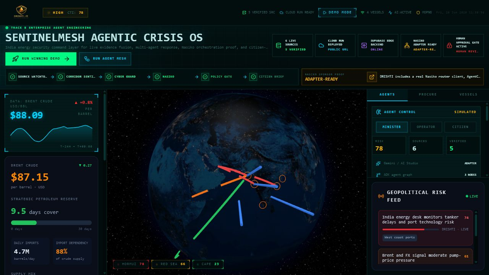
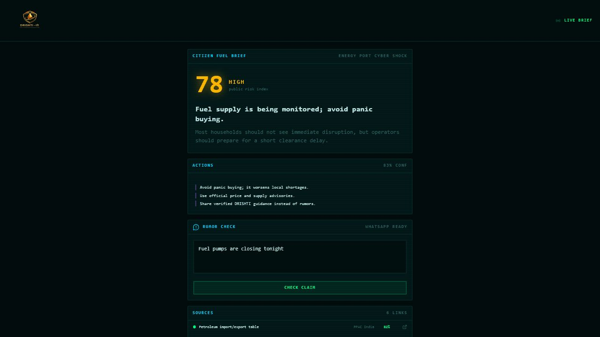
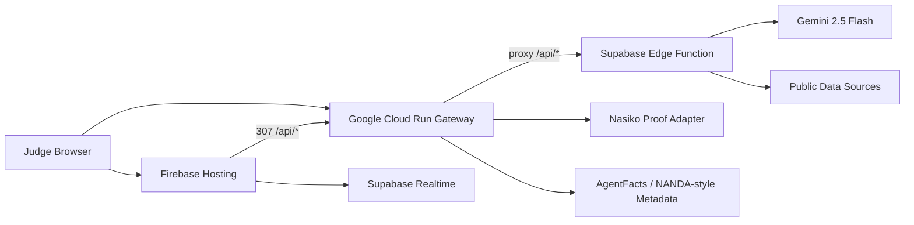

# SentinelMesh Agentic Crisis OS

**Fuel crises are chaotic. SentinelMesh turns scattered vessel, cyber, market, weather, and news signals into verified decisions and citizen-safe guidance.**

SentinelMesh is a hackathon-ready, multi-agent crisis command center for India's energy security. It is designed for **Track B: Enterprise Agent Engineering** and demonstrates a real agentic workflow across **Gemini / Google AI Studio**, **Google Cloud Run**, **Supabase Edge**, and a **Nasiko-ready orchestration adapter**.

In simple terms: when a shipping corridor, oil market, port cyber system, or public rumor starts flashing red, SentinelMesh behaves like an AI crisis room. It gathers evidence, routes work across specialist agents, keeps risky decisions behind a human approval gate, and converts the result into clear guidance for both enterprise operators and common citizens.

## Live Submission

Use the Cloud Run URL as the primary hackathon submission URL.

| Item | URL |
| --- | --- |
| Main Cloud Run URL | https://drishti-sentinelmesh-or2awz4nzq-el.a.run.app |
| Polished Firebase frontend | https://drishti-sentinelmesh-500608.web.app |
| GitHub repo | https://github.com/Induj1/drishti-energy-intel |
| Cloud Run API health | https://drishti-sentinelmesh-or2awz4nzq-el.a.run.app/api/health |
| Nasiko proof endpoint | https://drishti-sentinelmesh-or2awz4nzq-el.a.run.app/api/nasiko/probe |
| AgentFacts metadata | https://drishti-sentinelmesh-or2awz4nzq-el.a.run.app/api/agentfacts |

## What Judges See First







## The Problem

During an energy or infrastructure crisis, the real issue is not that data is missing. The issue is that the data is scattered.

- Vessel and corridor risk are separate from fuel prices.
- Cyber alerts are separate from port and logistics operations.
- News and public rumors move faster than official communication.
- Decision-makers need evidence, not another generic chatbot.
- Citizens need calm guidance, not raw dashboards.

SentinelMesh solves this by turning messy live signals into a coordinated agent workflow.

## The Solution

SentinelMesh is an **AI crisis operating system** with a visible multi-agent chain:

| Agent | Role |
| --- | --- |
| Source Watchtower | Pulls and verifies public data sources such as energy, news, cyber, weather, and vessel evidence. |
| Corridor Sentinel | Scores chokepoints such as Hormuz, Red Sea, Cape routes, and Indian port exposure. |
| Cyber Guard | Checks port and infrastructure cyber risk using security intelligence sources. |
| Nasiko Orchestrator | Acts as the sponsor-ready bridge for agent handoffs, workflow routing, and future observability. |
| Policy Gate | Blocks unsafe automatic action and requires human review for market-moving decisions. |
| Citizen Brief | Converts complex crisis intelligence into simple public guidance for normal people. |

The result is not just a dashboard. It is a working agentic workflow: evidence in, agent reasoning in the middle, safe decisions out.

## Why This Can Win

| Judging Area | How SentinelMesh Scores |
| --- | --- |
| Innovation and Creativity | Frames energy security as a multi-agent crisis OS, not a chatbot or static dashboard. It connects enterprise crisis response to citizen safety. |
| Technical Execution | Deployed web app, API gateway, Supabase Edge backend, live/fallback data fusion, multi-agent orchestration, mobile/NFC views, human approval gate, and public endpoints. |
| Google Tool Utilization | Gemini 2.5 Flash for agent reasoning, Google AI Studio compatible API usage, and Google Cloud Run as the mandatory public deployment layer. |
| Live Deployment | Cloud Run URL is public and active. Firebase frontend is a polished visual backup. |
| Presentation and Demo | One obvious `RUN WINNING DEMO` button, visible agent chain, proof badges, Nasiko proof panel, and citizen view. |

## Verified Production Proof

Latest verified behavior:

- Cloud Run public URL is active.
- Firebase frontend is active.
- Firebase `/api/*` redirects to Cloud Run using method-preserving `307`.
- Cloud Run `/api/*` routes proxy into the Supabase Edge backend.
- `/api/health` reports Gemini-backed AI with `gemini-2.5-flash`.
- Dashboard shows non-zero live proof such as vessels, verified sources, Cloud Run, Supabase, Nasiko, and approval gate status.
- Agent mesh run expands to **12 total evidence sources** with **11 live public sources** in the backend response.
- Browser verification passed on `/`, `/mobile`, and `/nfc` with no fresh console errors after the latest fix.

Useful proof links:

```text
https://drishti-sentinelmesh-or2awz4nzq-el.a.run.app/api/health
https://drishti-sentinelmesh-or2awz4nzq-el.a.run.app/api/live/summary
https://drishti-sentinelmesh-or2awz4nzq-el.a.run.app/api/nasiko/probe
https://drishti-sentinelmesh-or2awz4nzq-el.a.run.app/api/agentfacts
```

## Demo Flow

1. Open the Cloud Run URL: `https://drishti-sentinelmesh-or2awz4nzq-el.a.run.app`.
2. Show the first screen: title, globe, proof badges, Nasiko proof panel, and agent chain.
3. Click `RUN WINNING DEMO`.
4. Show the risk level, live evidence count, and agent chain.
5. Open the `AGENTS` tab and show Source Watchtower, Corridor Sentinel, Cyber Guard, Nasiko, Policy Gate, and Citizen Brief.
6. Open `/api/health` to prove Gemini is live.
7. Open `/api/nasiko/probe` to prove Nasiko sponsor readiness.
8. Open `/mobile` to show the citizen fuel brief.
9. Open `/nfc` to show the NFC-style public safety card.

## 60 Second Video Script

Hi everyone, we are presenting **SentinelMesh Agentic Crisis OS**, an AI-powered crisis command center for energy security and public safety.

The problem is that during a fuel or infrastructure crisis, the important signals are scattered. Vessel delays are in one place, fuel prices are somewhere else, cyber alerts are separate, and citizens mostly see rumors before they see verified guidance.

SentinelMesh brings these signals into one live command center. When I click **Run Winning Demo**, multiple AI agents start working together. Source Watchtower checks public evidence. Corridor Sentinel analyzes shipping routes. Cyber Guard checks port technology risk. Nasiko acts as the orchestration bridge for agent handoffs. Policy Gate keeps risky actions behind human approval. Citizen Brief converts the result into simple guidance for normal people.

Technically, this is built for Track B. Gemini powers the agent reasoning, Google Cloud Run provides the public deployment gateway, Supabase Edge runs the backend, and the Nasiko adapter proves sponsor-ready workflow integration.

The key idea is speed with safety. SentinelMesh does not blindly automate crisis decisions. It verifies evidence, explains the reasoning, and keeps humans in control.

In one line: **SentinelMesh turns live chaos into verified decisions.**

## Architecture



Primary demo path is Cloud Run. Firebase is the polished frontend and backup URL. Supabase is the backend system of record. Cloud Run satisfies the Track B public deployment requirement and gives judges a GCP-owned gateway.

## Google, GCP, Gemini, And AI Studio Usage

- **Gemini 2.5 Flash** powers agent and citizen reasoning through Gemini-compatible API calls.
- **Google AI Studio compatibility** keeps model setup simple for hackathon demos.
- **Google Cloud Run** hosts the public gateway and mandatory deployment URL.
- **Cloud Logging-friendly endpoints** expose clear health and API behavior.
- **Cloud Run URL** can be submitted directly even though the frontend also has Firebase Hosting polish.

## Nasiko Sponsor Integration

Nasiko is not hidden in the code. It is part of the story and the system design.

SentinelMesh includes:

- A visible Nasiko proof panel in the UI.
- `/api/nasiko/probe` endpoint for sponsor proof.
- `lib/nasiko.ts` router client for live Nasiko calls when credentials are available.
- `nasiko-agents/sentinelmesh-crisis-agent/Agentcard.json` so Nasiko can register SentinelMesh as an agent.
- A local Nasiko deployment guide in `docs/NASIKO_INTEGRATION.md`.

How Nasiko fits the future product:

- **LLM Router:** route each agent step to the best model.
- **MCP Gateway:** expose trusted crisis tools and data feeds.
- **Observability:** trace each agent handoff and evidence source.
- **MAF V1:** declare prompts, steps, and approval rules instead of hardcoding every workflow.
- **Multi Agent Harness:** run Source Watchtower, Cyber Guard, Policy Gate, and Citizen Brief as coordinated agents.
- **Agent Usage Dashboard:** measure cost, usage, failures, and lifecycle state.

## Core Endpoints

| Endpoint | Purpose |
| --- | --- |
| `/health` | Cloud Run gateway health. |
| `/api/health` | Supabase backend health plus Gemini provider/model proof. |
| `/api/live/summary` | Fused public data sweep. |
| `/api/vessels` | Vessel layer for tanker/cargo visualization. |
| `/api/news` | Crisis and risk feed. |
| `/api/agents/run` | Full multi-agent orchestration. |
| `/api/simulate` | Crisis simulation and agent run trigger. |
| `/api/mission-brief` | Citizen/operator/minister brief. |
| `/api/policy-gate` | Human approval rule engine. |
| `/api/rumor-check` | WhatsApp/Telegram rumor triage. |
| `/api/evidence-pack` | Judge evidence markdown and JSON. |
| `/api/agentfacts` | AgentFacts/NANDA-style metadata. |
| `/.well-known/agentfacts.json` | Discoverable agent metadata. |
| `/api/nasiko/probe` | Nasiko sponsor proof endpoint. |

## Data Sources

The app uses free/public sources and graceful fallbacks so the demo does not collapse if one external source is slow.

- PPAC India import/export references.
- FRED daily Brent crude CSV.
- Open-Meteo marine/weather risk.
- CISA Known Exploited Vulnerabilities JSON.
- FIRST EPSS cyber risk signal.
- OSV vulnerability query.
- EIA Today in Energy RSS.
- AISStream optional websocket key for live AIS.
- Public port/vessel schedule links as evidence references.

Exact petroleum cargo labels usually require paid AIS/port feeds, so the demo is transparent: it uses public evidence where available and simulated vessel motion where fully open data is insufficient.

## Citizen Impact

SentinelMesh is useful for enterprise teams, but it is also designed for a normal person.

- `/mobile` gives a simple fuel-risk brief.
- `/nfc` behaves like a public safety card that can be opened from an NFC tag.
- Rumor check turns panic messages into a calm verdict.
- Citizen Brief explains what to do without exposing raw crisis complexity.

This matters because a crisis response system only works if the public understands what is safe, what is verified, and what action to take next.

## Local Run

```bash
npm install
npm run dev
```

Open:

```text
http://localhost:3000
```

Production checks:

```bash
npm run lint
npm run build
npm run build:static
```

## Environment

```env
GEMINI_API_KEY=
GOOGLE_AI_API_KEY=
GOOGLE_API_KEY=
GEMINI_MODEL=gemini-2.5-flash

NASIKO_API_URL=
NASIKO_ACCESS_KEY=
NASIKO_ACCESS_SECRET=
NASIKO_TOKEN=
NASIKO_ROUTER_PATH=/router
NASIKO_TRACE_URL=http://localhost:6006
NASIKO_WORKFLOW_ID=sentinelmesh-energy-crisis
NASIKO_WEBHOOK_URL=

AISSTREAM_API_KEY=

NEXT_PUBLIC_APP_URL=https://your-cloud-run-url
APP_URL=https://your-cloud-run-url
NEXT_PUBLIC_DRISHTI_API_BASE=https://your-cloud-run-url
NEXT_PUBLIC_CLOUD_RUN_URL=https://your-cloud-run-url

NEXT_PUBLIC_SUPABASE_URL=
NEXT_PUBLIC_SUPABASE_ANON_KEY=

TELEGRAM_BOT_TOKEN=
```

Never commit real API keys. Use Supabase secrets or cloud runtime secrets for Gemini, OpenAI, Telegram, and any private tokens. The Supabase anon key is a public browser key, not a service-role key.

## Cloud Run Deployment

The production Cloud Run service is a lightweight Node gateway stored in `cloudrun-gateway/`. It keeps `/health` local, exposes `/api/nasiko/probe`, and proxies every other `/api/*` request to Supabase Edge.

```bash
gcloud run services replace cloudrun-gateway/service.yaml \
  --region asia-south1 \
  --project drishti-500608
```

## Firebase Frontend Deployment

Static frontend export:

```bash
NEXT_PUBLIC_DRISHTI_API_BASE=https://drishti-sentinelmesh-or2awz4nzq-el.a.run.app \
NEXT_PUBLIC_CLOUD_RUN_URL=https://drishti-sentinelmesh-or2awz4nzq-el.a.run.app \
NEXT_PUBLIC_GEMINI_BADGE=live \
npm run build:static
```

Deploy:

```bash
npx firebase-tools@latest deploy --only hosting --project sample-firebase-ai-app-5e44c
```

`firebase.json` redirects `/api/:path*` to Cloud Run with `307`, so POST routes keep working.

## Supabase Edge Backend

Supabase Edge hosts the live backend function:

```bash
npx supabase functions deploy drishti-api \
  --project-ref YOUR_PROJECT_REF \
  --no-verify-jwt

npx supabase secrets set \
  GEMINI_API_KEY=... \
  GEMINI_MODEL=gemini-2.5-flash \
  --project-ref YOUR_PROJECT_REF
```

Database migration:

```bash
npx supabase db push
```

The migration adds:

- `source_snapshots`
- `agent_runs`
- `mission_briefs`

The app runs without database persistence, but Supabase adds realtime crisis sync and audit persistence.

## Local Nasiko Setup

```bash
git clone https://github.com/Nasiko-Labs/nasiko.git
cd nasiko
cp .nasiko-local.env.example .nasiko-local.env
docker compose -f docker-compose.local.yml --env-file .nasiko-local.env up -d
```

After credentials are generated:

```bash
cat orchestrator/superuser_credentials.json
```

Set DRISHTI env:

```env
NASIKO_API_URL=http://localhost:9100
NASIKO_ACCESS_KEY=NASK_...
NASIKO_ACCESS_SECRET=...
NASIKO_TRACE_URL=http://localhost:6006
```

Probe:

```bash
curl http://localhost:3000/api/nasiko/probe
```

## Submission One-Liner

**SentinelMesh is a Gemini-powered, Cloud Run deployed, Nasiko-ready multi-agent crisis OS that turns live energy, cyber, vessel, and news chaos into verified decisions for operators and safe guidance for citizens.**
