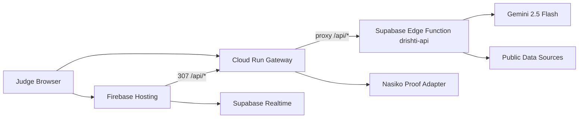

# DRISHTI SentinelMesh Agentic Crisis OS

Hackathon-ready Agentic Crisis OS for India's energy security, built for **Track B: Enterprise Agent Engineering**.

DRISHTI turns public energy, maritime, weather, cyber, and news signals into a multi-agent command surface for policy teams, operators, and citizens. The deployed version uses **Google Cloud Run as the public API gateway**, **Supabase Edge Functions as the backend**, **Gemini 2.5 Flash for agent/citizen reasoning**, and a **Nasiko sponsor proof adapter** for enterprise orchestration demos.

## Live Submission URLs

Use the **Cloud Run URL** as the main hackathon submission URL:

- Main submission URL: `https://drishti-sentinelmesh-or2awz4nzq-el.a.run.app`
- Firebase frontend: `https://drishti-sentinelmesh-500608.web.app`
- Cloud Run API gateway: `https://drishti-sentinelmesh-or2awz4nzq-el.a.run.app/api/*`
- Supabase Edge backend: `https://bkzbcolbucbvnvyqveoe.supabase.co/functions/v1/drishti-api`
- Nasiko proof endpoint: `https://drishti-sentinelmesh-or2awz4nzq-el.a.run.app/api/nasiko/probe`

## Verified Production Status

- Cloud Run `/health` returns `200`.
- Cloud Run `/api/vessels`, `/api/news`, `/api/live/summary`, `/api/simulate`, `/api/nasiko/probe` return `200`.
- Firebase `/api/*` returns `307 -> 200` via method-preserving redirect to Cloud Run.
- POST `/api/agents/run` works through Cloud Run and Firebase redirect.
- `/api/health` reports Gemini provider as `gemini` with model `gemini-2.5-flash`.
- Browser UI shows non-zero live state: `4 VESSELS`, `5 VERIFIED SRC`, `SOURCES 6`, `VERIFIED 5`.
- Browser console verification completed with zero errors.

## Why This Fits Track B

- **Innovation & creativity:** agentic crisis operating system for energy security, not a generic chatbot/dashboard.
- **Technical execution:** live public data fusion, multi-agent workflow, approval gate, citizen brief, NFC/mobile surfaces, Cloud Run gateway, Supabase Edge backend.
- **Google tool utilization:** Gemini 2.5 Flash, AI Studio-compatible Gemini REST calls, Google Cloud Run public deployment, Cloud Logging-friendly health endpoints.
- **Live deployment:** Cloud Run public URL is active and should be submitted.
- **Presentation:** one obvious `RUN WINNING DEMO` path, visible source proof, Nasiko proof panel, and policy gate.

## Demo Path

1. Open `https://drishti-sentinelmesh-or2awz4nzq-el.a.run.app`.
2. Click `RUN WINNING DEMO` or `DEMO MODE`.
3. Show the first-screen proof ribbon: Cloud Run, Supabase, Nasiko, Agent Mesh, approval gate.
4. Open the `AGENTS` tab and show Source Watchtower, Corridor Sentinel, Cyber Guard, Nasiko bridge, Policy Gate, and Citizen Brief.
5. Open `/mobile` for citizen mode.
6. Open `/nfc` for the NFC fuel-safety brief.
7. Open `/api/health` to prove Gemini is live.
8. Open `/api/nasiko/probe` to prove sponsor integration readiness.

## Architecture



Primary path for the demo is Cloud Run. Firebase is a polished static frontend and backup URL. Supabase remains the backend system of record, while Cloud Run satisfies the Track B public deployment requirement and gives judges one GCP-owned API gateway.

## Core Endpoints

| Endpoint | Purpose |
| --- | --- |
| `/health` | Cloud Run gateway health |
| `/api/health` | Supabase backend health plus Gemini provider/model proof |
| `/api/live/summary` | Fused public data sweep |
| `/api/vessels` | Vessel layer for tankers, LNG, coal, and product cargo |
| `/api/news` | Crisis/risk feed |
| `/api/agents/run` | Full multi-agent orchestration |
| `/api/simulate` | Crisis simulation and agent run trigger |
| `/api/mission-brief` | Citizen/operator/minister brief |
| `/api/policy-gate` | Human approval rule engine |
| `/api/rumor-check` | WhatsApp/Telegram rumor triage |
| `/api/evidence-pack` | Judge evidence markdown and JSON |
| `/api/agentfacts` | AgentFacts/NANDA-compatible metadata |
| `/.well-known/agentfacts.json` | Discoverable agent metadata |
| `/api/nasiko/probe` | Nasiko sponsor proof endpoint |

All `/api/*` routes work on Cloud Run. Firebase Hosting redirects `/api/*` to Cloud Run with `307`, so method-sensitive POST routes keep working.

## Data Sources

The app works with free/public sources and graceful fallbacks.

- PPAC India import/export references.
- FRED daily Brent crude CSV.
- Open-Meteo marine/weather risk.
- CISA Known Exploited Vulnerabilities JSON.
- EIA Today in Energy RSS.
- AISStream optional websocket key for live AIS.
- Public port/vessel schedule links as evidence references.

Exact petroleum cargo labels usually require paid AIS/port feeds, so the demo labels vessel cargo types transparently and uses simulated motion where open data is insufficient.

## Environment

```env
GEMINI_API_KEY=
GOOGLE_AI_API_KEY=
GOOGLE_API_KEY=
GEMINI_MODEL=gemini-2.5-flash

NASIKO_API_URL=
NASIKO_ACCESS_KEY=
NASIKO_ACCESS_SECRET=
NASIKO_TOKEN=
NASIKO_ROUTER_PATH=/router
NASIKO_TRACE_URL=http://localhost:6006
NASIKO_WORKFLOW_ID=sentinelmesh-energy-crisis
NASIKO_WEBHOOK_URL=

AISSTREAM_API_KEY=

NEXT_PUBLIC_APP_URL=https://your-cloud-run-url
APP_URL=https://your-cloud-run-url
NEXT_PUBLIC_DRISHTI_API_BASE=https://your-cloud-run-url
NEXT_PUBLIC_CLOUD_RUN_URL=https://your-cloud-run-url

NEXT_PUBLIC_SUPABASE_URL=
NEXT_PUBLIC_SUPABASE_ANON_KEY=

TELEGRAM_BOT_TOKEN=
```

Never commit real API keys. Use Supabase secrets for `GEMINI_API_KEY`, `OPENAI_API_KEY`, and messaging tokens. A Supabase anon key in frontend/deploy config is a public browser key, not a service-role key.

## Local Run

```bash
npm install
npm run dev
```

Open `http://localhost:3000`.

## Cloud Run Gateway Deployment

The production Cloud Run service is a lightweight Node gateway stored in `cloudrun-gateway/`. It keeps `/health` local, exposes `/api/nasiko/probe`, and proxies every other `/api/*` request to Supabase Edge.

```bash
gcloud run services replace cloudrun-gateway/service.yaml \
  --region asia-south1 \
  --project drishti-500608
```

## Firebase Frontend Deployment

Static frontend export:

```bash
NEXT_PUBLIC_DRISHTI_API_BASE=https://drishti-sentinelmesh-or2awz4nzq-el.a.run.app \
NEXT_PUBLIC_CLOUD_RUN_URL=https://drishti-sentinelmesh-or2awz4nzq-el.a.run.app \
NEXT_PUBLIC_GEMINI_BADGE=live \
npm run build:static
```

Deploy:

```bash
npx firebase-tools@latest deploy --only hosting --project sample-firebase-ai-app-5e44c
```

`firebase.json` redirects `/api/:path*` to Cloud Run with `307`.

## Supabase Edge Backend

Supabase Edge hosts the live backend function:

```bash
npx supabase functions deploy drishti-api \
  --project-ref YOUR_PROJECT_REF \
  --no-verify-jwt

npx supabase secrets set \
  GEMINI_API_KEY=... \
  GEMINI_MODEL=gemini-2.5-flash \
  --project-ref YOUR_PROJECT_REF
```

Database migration:

```bash
npx supabase db push
```

The migration adds:

- `source_snapshots`
- `agent_runs`
- `mission_briefs`

The app runs without database persistence, but Supabase adds realtime crisis sync and audit persistence.

## Nasiko Sponsor Integration

The app has two Nasiko paths:

1. DRISHTI calls Nasiko's router from `lib/nasiko.ts` when sponsor/local credentials are available.
2. Nasiko can register DRISHTI as an agent using `nasiko-agents/sentinelmesh-crisis-agent/Agentcard.json`.

Local Nasiko setup:

```bash
git clone https://github.com/Nasiko-Labs/nasiko.git
cd nasiko
cp .nasiko-local.env.example .nasiko-local.env
docker compose -f docker-compose.local.yml --env-file .nasiko-local.env up -d
```

After credentials are generated:

```bash
cat orchestrator/superuser_credentials.json
```

Set DRISHTI env:

```env
NASIKO_API_URL=http://localhost:9100
NASIKO_ACCESS_KEY=NASK_...
NASIKO_ACCESS_SECRET=...
NASIKO_TRACE_URL=http://localhost:6006
```

Probe:

```bash
curl http://localhost:3000/api/nasiko/probe
```

## Mobile, NFC, And Messaging

- `/mobile`: citizen-facing fuel/risk brief.
- `/nfc`: NFC-card style public safety brief.
- Telegram bot code is in `telegram/` with commands for `/brief`, `/rumor`, `/sources`, `/risk`, `/vessels`, `/spr`, `/simulate`, `/news`, and `/price`.

## Hackathon Narrative

India does not just need another dashboard. It needs an agentic response layer that can fuse live public signals, explain evidence, enforce approval gates, and translate state-level risk into citizen-safe guidance. DRISHTI SentinelMesh is that layer.

